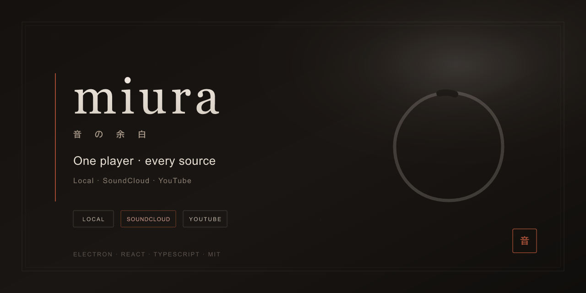

<div align="center">



<br/>

# miura

### One player. Every source you already use.

Local files · **SoundCloud** · **YouTube**  
One queue · one transport bar · profiles that stay on your machine

<br/>

[](https://www.electronjs.org/)
[](https://react.dev/)
[](https://www.typescriptlang.org/)
[](https://vitejs.dev/)
[](./LICENSE)

[](https://github.com/wwrmwrm/miura/stargazers)
[](https://github.com/wwrmwrm/miura/issues)
[](#quick-start)

<br/>

```bash
git clone https://github.com/wwrmwrm/miura.git && cd miura && npm install && npm run dev
```

<sub>Node.js 18+ · MIT · use at your own risk</sub>

</div>

---

## Why miura?

| Most apps | miura |
|-----------|--------|
| Local *or* one streaming brand | **Local + SoundCloud + YouTube** in one shell |
| Three windows, three queues | **One queue**, one shuffle bag, one bar |
| Account lock-in | **Local profiles** — favorites & settings on your PC |

Built for people who already live in folders, SoundCloud likes, and YouTube rabbit holes — and want them **together**.

---

## Features

### Sources

<table>
<tr>
<td width="33%" valign="top">

#### Local
Folders & watch · ID3 covers · artists / albums / genres · smart lists · M3U · library-side tags

</td>
<td width="33%" valign="top">

#### SoundCloud
Open progressive & HLS via api-v2 · login · library · playlists  
<small>DRM / Go+ → official client · [Widevine notes](docs/WIDEVINE.md)</small>

</td>
<td width="33%" valign="top">

#### YouTube
In-app search · same queue as everything else · play alongside local & SC

</td>
</tr>
</table>

### Player & library

- **Unified queue** — mix local, SoundCloud, and YouTube freely  
- **Shuffle bag** — no repeats until the full cycle is done  
- **Repeat** — off / all / one  
- **Virtualized lists** — long playlists stay smooth  
- **Import** — text lists & M3U, resolve across sources  
- **Mini player** — drives the main window (one audio engine)  
- **Profiles** — local accounts with scoped favorites & settings  

### Desktop

- Discord **Rich Presence**  
- **Media keys** & tray-friendly shell  
- Optional **SOCKS / HTTP proxy** (all traffic or SC-only)  
- **10 languages** — Русский · English (US) · Deutsch · Español · Français · Italiano · Nederlands · Polski · Português · Svenska  

---

## Quick start

```bash
git clone https://github.com/wwrmwrm/miura.git
cd miura
npm install
npm run dev
```

| Need | Version / platform |
|------|---------------------|
| Node.js | **18+** |
| OS | Windows · macOS · Linux |

---

## Scripts

| Command | What it does |
|---------|----------------|
| `npm run dev` | Vite + Electron (development) |
| `npm run build` | Production renderer → `dist/` |
| `npm start` | Electron against `dist/` |
| `npm run typecheck` | TypeScript check |
| `npm run pack` | electron-builder (dir) |
| `npm run dist:win` | Windows installer / portable |

---

## Stack

```text
Electron  ·  React 18  ·  TypeScript  ·  Vite
hls.js  ·  youtubei.js  ·  music-metadata  ·  discord-rpc
```

---

## Notes

> **Be a good listener.** Respect platform terms and artists’ rights.

- SoundCloud **DRM / Go+** tracks are not bypassed — only open streams  
- Local tag edits stay in miura’s library; **files on disk are not rewritten** by default  
- YouTube may need a solid network path (sometimes SOCKS with **all traffic**)  
- Mini player controls the **main** window — no second audio pipeline  

---

## Contributing

Issues and PRs welcome. Prefer small, focused changes and keep the player core (queue, shuffle bag, multi-source) stable.

---

## License

Released under the **[MIT License](./LICENSE)**.

Free to use, fork, and remix. You are responsible for how you access third-party services.

---

<div align="center">

**miura** — listen the way you already live.

[⭐ Star](https://github.com/wwrmwrm/miura) · [Issues](https://github.com/wwrmwrm/miura/issues) · [Clone](https://github.com/wwrmwrm/miura.git)

</div>
